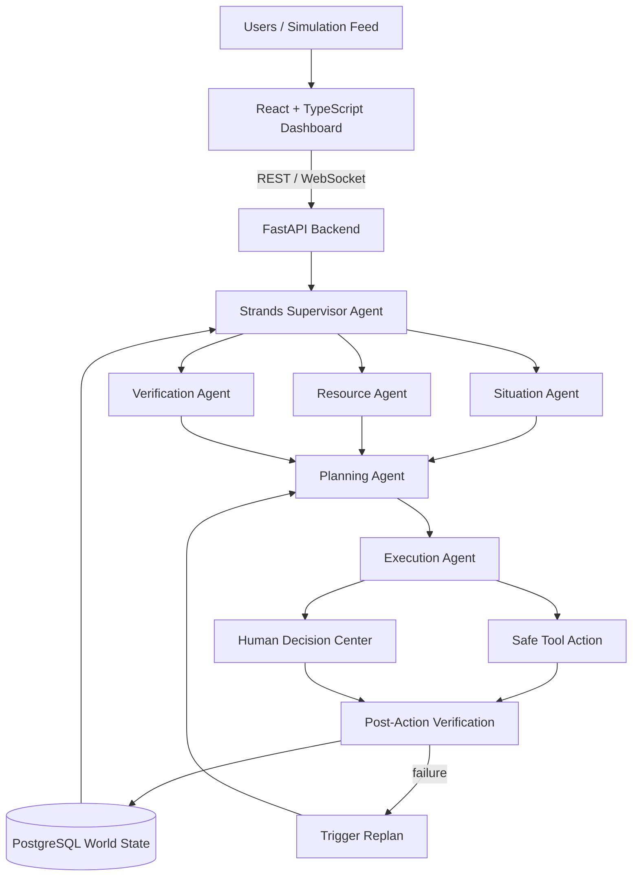

# NEXUS — Architecture

## System Diagram



## Component Responsibilities

| Component | Responsibility |
|---|---|
| React + TypeScript dashboard | Incident view, live world state, resource center, human decision center, agent activity feed |
| FastAPI backend | REST/WebSocket API, event ingestion, DB access, agent invocation, human decision callbacks |
| Strands Supervisor Agent | Orchestrates the observe→plan→act→verify→replan loop; delegates to sub-agents |
| Situation Agent | Interprets new events against current world state; flags conflicts/duplicates |
| Resource Agent | Tracks resource/team availability, capacity, and existing assignments |
| Verification Agent | Scores confidence on incoming reports and on action outcomes |
| Planning Agent | Converts goal + world state + available resources into an executable plan |
| Execution Agent | Calls tools for safe actions, or routes to human review when a policy boundary is crossed |
| PostgreSQL | Authoritative world state: incidents, locations, resources, assignments, plans, tasks, decisions, audit logs |

## Why Each AWS Service Is Used

| Service | Used for | Required? |
|---|---|---|
| Strands Agents SDK | Agent orchestration, tool selection, planning/replanning | Mandatory |
| Amazon Bedrock | LLM reasoning for all agents | Strongly recommended |
| Amazon Bedrock AgentCore | Optional deployment target for the supervisor agent | Optional — strengthens Technical Implementation score |
| PostgreSQL | Authoritative, queryable world state (not just vector/LLM memory) | Core |
| Amazon S3 / SQS / EventBridge | Only added if the demo needs async event ingestion at scale | Optional — omit if not demonstrated |

No AWS service is included purely for architectural complexity — each one maps to a capability shown in the demo.

## Agent Decision Loop

```text
1.  Receive event
2.  Load current world state
3.  Analyze event (Situation Agent)
4.  Check for conflicts/duplicates
5.  Verify if necessary (Verification Agent)
6.  Update world state
7.  Determine whether current plans are affected
8.  Recalculate priorities if required
9.  Find available resources (Resource Agent)
10. Generate/revise plan (Planning Agent)
11. Validate plan against authorization policy
12. Execute safe actions (Execution Agent)
13. Verify results
14. Success  → continue
    Failure  → replan
    Human required → create decision, wait, resume
15. Record audit trail
```

## Authorization Boundary (Safe vs. Human-Required)

Autonomous actions are limited to those within a configured policy (see `backend/app/services/policy.py` once implemented): recalculating a plan, reserving a non-critical resource, notifying an assigned volunteer, marking duplicates. Anything crossing a policy threshold — conflicting high-priority allocation, irreversible actions, policy ambiguity — is routed to the Human Decision Center with an explicit "why I stopped" explanation.
